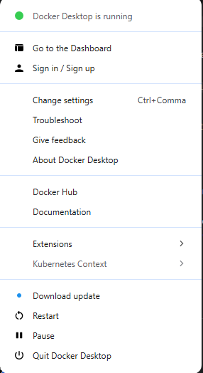
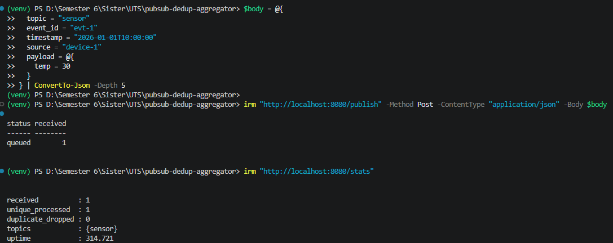
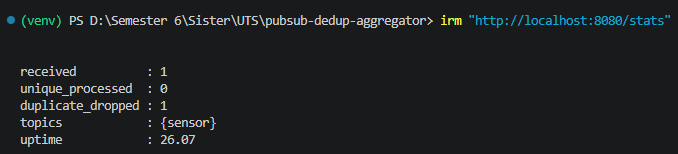
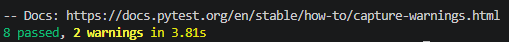

# Laporan UTS Sistem Paralel dan Terdistribusi

- Nama: Naufal Tiarana Putra
- NIM: 11231071
- Kelas: A
- Mata Kuliah: Sistem Paralel dan Terdistribusi
- Dosen: Riska Kurniyanto Abdullah, S.T., M.Kom.
- Tanggal: 22 April 2026
- Repository GitHub: [\[pubsub-dedup-aggregator\]](https://github.com/Naufalpc11/pubsub-dedup-aggregator)
- Link Video Demo: [UTS Sistem Terdistribusi - Demo Pub-Sub Dedup Aggregator (At-Least-Once, Idempotency, Persistensi)](https://youtu.be/tvs8Ss4XCXo)

## 1. Bagian Teori

### T1 (Bab 1): Karakteristik Sistem Terdistribusi dan Trade-off
Sistem terdistribusi memiliki sejumlah karakteristik utama, yaitu transparansi (seperti access, location, dan replication transparency), kemampuan menjalankan concurrent execution, serta ketahanan terhadap kegagalan (fault tolerance). Dalam lingkungan terdistribusi, komponen sistem berjalan secara independen dan berkomunikasi melalui jaringan yang tidak selalu reliabel, sehingga menimbulkan tantangan dalam menjaga konsistensi data dan koordinasi antar komponen. Dalam konteks Pub-Sub log aggregator, sistem dirancang untuk mendukung komunikasi berbasis `event` secara asynchronous, di mana publisher dan subscriber tidak memiliki ketergantungan langsung (loose coupling). Hal ini meningkatkan skalabilitas dan fleksibilitas sistem.

Namun, pendekatan ini menimbulkan trade-off yang signifikan. Salah satunya adalah antara consistency dan availability, di mana sistem harus memilih apakah akan menjamin konsistensi data secara ketat atau tetap tersedia meskipun terjadi kegagalan. Selain itu, terdapat trade-off antara latency dan reliability, khususnya ketika menggunakan at-least-once delivery, yang meningkatkan keandalan pengiriman `event` tetapi memungkinkan terjadinya duplikasi. Sebaliknya, exactly-once delivery lebih konsisten namun kompleks dan mahal secara implementasi.

Oleh karena itu, sistem log aggregator biasanya mengadopsi pendekatan praktis seperti idempotency dan deduplication untuk mengatasi duplikasi tanpa menambah kompleksitas berlebihan. (Tanenbaum & Van Steen, 2007)

### T2 (Bab 2): Client-Server vs Publish-Subscribe
Arsitektur client-server merupakan model komunikasi di mana client secara langsung mengirim permintaan ke server dan menunggu respons. Model ini bersifat sinkron dan tightly coupled, sehingga cocok untuk aplikasi dengan kebutuhan kontrol tinggi dan interaksi yang deterministik. Namun, dalam konteks log aggregation, model ini kurang efisien karena tidak mampu menangani aliran `event` dalam jumlah besar secara fleksibel dan tidak mendukung komunikasi asynchronous secara optimal.

Sebaliknya, arsitektur publish-subscribe memungkinkan komunikasi berbasis `event` dengan tingkat decoupling yang tinggi antara publisher dan subscriber. Publisher hanya mengirim `event` ke sistem tanpa mengetahui siapa yang akan mengonsumsinya, sementara subscriber dapat menerima `event` sesuai dengan `topic` yang diminati. Pendekatan ini sangat cocok untuk sistem yang bersifat event-driven, seperti log aggregator, karena mampu menangani data yang datang secara tidak teratur dan dalam skala besar.

Pemilihan Pub-Sub menjadi tepat ketika sistem membutuhkan high scalability, loose coupling, dan kemampuan untuk memproses `event` secara asynchronous. Namun, model ini juga membawa tantangan tambahan seperti pengelolaan duplicate `event`, ordering, dan konsistensi data. Dengan demikian, meskipun lebih kompleks, Pub-Sub memberikan fleksibilitas dan skalabilitas yang lebih baik dibandingkan client-server. (Tanenbaum & Van Steen, 2007)

### T3 (Bab 3): At-least-once vs Exactly-once dan Pentingnya Idempotency
Dalam sistem terdistribusi, delivery semantics menentukan bagaimana `event` dikirim dan diproses oleh sistem. At-least-once delivery menjamin bahwa setiap `event` akan diterima setidaknya satu kali, namun memungkinkan terjadinya duplikasi akibat mekanisme retry ketika terjadi kegagalan komunikasi. Sebaliknya, exactly-once delivery menjamin bahwa `event` hanya diproses satu kali, tetapi implementasinya memerlukan koordinasi kompleks dan pengelolaan state yang ketat.

Dalam praktiknya, banyak sistem memilih at-least-once delivery karena lebih sederhana dan lebih tahan terhadap kegagalan jaringan. Namun, pendekatan ini menimbulkan masalah duplicate processing, yang dapat menyebabkan inkonsistensi data jika tidak ditangani dengan baik. Oleh karena itu, konsep idempotent consumer menjadi sangat penting.

Idempotency berarti bahwa pemrosesan `event` yang sama berulang kali tidak akan mengubah hasil akhir sistem. Dalam log aggregator, penggunaan `event_id` sebagai identifier unik memungkinkan sistem untuk mendeteksi apakah suatu `event` sudah pernah diproses sebelumnya. Dengan demikian, meskipun `event` diterima lebih dari sekali, sistem tetap menghasilkan output yang konsisten.

Pendekatan ini menjadi solusi praktis untuk menggabungkan keandalan at-least-once delivery dengan konsistensi hasil tanpa harus mengimplementasikan exactly-once yang kompleks. (Tanenbaum & Van Steen, 2007)

### T4 (Bab 4): Skema Penamaan Topic dan Event ID
Dalam sistem publish-subscribe, mekanisme penamaan memainkan peran penting dalam mengidentifikasi dan mengelompokkan `event`. `Topic` digunakan sebagai channel logis untuk mengelompokkan `event` berdasarkan kategori tertentu, sedangkan `event_id` berfungsi sebagai identifier unik untuk setiap `event`. Skema penamaan yang baik harus bersifat globally unique dan collision-resistant agar tidak terjadi konflik identitas antar `event`.

Untuk mencapai hal ini, `event_id` dapat dibentuk menggunakan kombinasi atribut seperti timestamp, source identifier, dan counter, atau menggunakan UUID. Dalam implementasi deduplication, pasangan (`topic`, `event_id`) digunakan sebagai kunci utama untuk menentukan apakah suatu `event` sudah pernah diproses.

Dampak dari desain ini sangat signifikan terhadap efektivitas deduplication. Jika `event_id` tidak unik atau tidak konsisten, sistem tidak dapat membedakan antara `event` baru dan duplikat. Sebaliknya, skema yang baik memungkinkan sistem melakukan filtering secara akurat dan efisien.

Dengan demikian, penamaan yang tepat tidak hanya mendukung deduplication, tetapi juga meningkatkan skalabilitas dan keandalan sistem secara keseluruhan. (Tanenbaum & Van Steen, 2007)

### T5 (Bab 5): Ordering Praktis dan Batasannya
Ordering dalam sistem terdistribusi merupakan tantangan utama karena tidak adanya global clock yang dapat digunakan untuk menentukan urutan kejadian secara absolut. Tanenbaum menjelaskan bahwa terdapat beberapa jenis ordering, seperti total ordering dan partial ordering. Total ordering menjamin bahwa semua node dalam sistem melihat urutan `event` yang sama, namun implementasinya memerlukan koordinasi yang kompleks dan overhead yang tinggi.

Dalam konteks log aggregator, total ordering tidak selalu diperlukan. Sebagai alternatif, pendekatan praktis seperti penggunaan timestamp dan monotonic counter dapat digunakan untuk memberikan approximate ordering. Setiap `event` diberi timestamp (misalnya ISO8601) dan counter lokal untuk menjaga urutan relatif.

Namun, pendekatan ini memiliki keterbatasan, seperti kemungkinan terjadinya clock skew antar node. Oleh karena itu, sistem harus dirancang untuk toleran terhadap out-of-order event, terutama jika urutan tidak mempengaruhi hasil akhir secara signifikan.

Dengan demikian, keputusan untuk tidak menggunakan total ordering merupakan trade-off yang rasional antara kompleksitas dan kebutuhan sistem. (Tanenbaum & Van Steen, 2007)

### T6 (Bab 6): Failure Modes dan Mitigasi
Sistem terdistribusi rentan terhadap berbagai failure modes, seperti duplicate `event`, out-of-order delivery, dan node crash. Duplicate `event` biasanya terjadi akibat mekanisme retry dalam at-least-once delivery, sementara out-of-order delivery disebabkan oleh variasi latency jaringan.

Untuk mengatasi masalah ini, sistem perlu menerapkan strategi mitigasi yang tepat. Salah satunya adalah penggunaan retry dengan backoff strategy untuk menghindari overload. Selain itu, penggunaan durable deduplication store memungkinkan sistem untuk menyimpan informasi `event` yang telah diproses secara persisten.

Dalam hal crash recovery, sistem harus mampu melanjutkan operasi tanpa kehilangan state penting. Oleh karena itu, penggunaan penyimpanan persisten seperti SQLite menjadi penting untuk menjaga integritas data.

Dengan demikian, sistem harus dirancang dengan asumsi bahwa kegagalan merupakan kondisi normal, dan bukan pengecualian. (Tanenbaum & Van Steen, 2007)

### T7 (Bab 7): Eventual Consistency pada Aggregator
Eventual consistency adalah model konsistensi di mana sistem tidak menjamin konsistensi secara langsung, tetapi akan mencapai konsistensi dalam jangka waktu tertentu. Model ini umum digunakan dalam sistem terdistribusi yang mengutamakan availability dan scalability.

Dalam log aggregator, `event` dapat diproses dengan delay atau dalam urutan yang berbeda. Namun, dengan adanya idempotency dan deduplication, sistem tetap dapat mencapai kondisi akhir yang konsisten.

Idempotency memastikan bahwa duplicate `event` tidak mengubah hasil, sedangkan deduplication mencegah pemrosesan ulang `event` yang sama. Kombinasi keduanya memungkinkan sistem untuk bekerja dengan at-least-once delivery tanpa mengorbankan konsistensi.

Dengan demikian, eventual consistency menjadi pendekatan yang realistis dan efektif dalam sistem terdistribusi modern. (Tanenbaum & Van Steen, 2007)

### T8 (Bab 1-7): Metrik Evaluasi dan Implikasi Desain
Evaluasi sistem terdistribusi dilakukan menggunakan metrik seperti throughput, latency, dan duplicate rate. Throughput mengukur jumlah `event` yang dapat diproses dalam satuan waktu, sedangkan latency mengukur waktu yang dibutuhkan sejak `event` diterima hingga diproses.

Duplicate rate merupakan metrik penting dalam sistem dengan at-least-once delivery, karena menunjukkan seberapa sering `event` duplikat terjadi dan seberapa efektif sistem dalam menanganinya.

Keputusan desain seperti penggunaan in-memory queue, asynchronous processing, dan persistent deduplication store akan mempengaruhi metrik tersebut. Misalnya, penggunaan SQLite meningkatkan reliability, tetapi dapat menambah latency.

Dengan mengaitkan metrik ini dengan keputusan desain, pengembang dapat menentukan trade-off yang optimal antara performa dan konsistensi sistem. (Tanenbaum & Van Steen, 2007)

---

## 2. Ringkasan Sistem dan Arsitektur

### 2.1 Tujuan Sistem
Tujuan utama sistem adalah menerima event/log dari publisher, memproses event secara asinkron, lalu menyimpan hanya event unik. Pada lingkungan distribusi, event duplikat lazim terjadi akibat retry, timeout, atau gangguan jaringan. Karena itu, arsitektur dirancang agar toleran terhadap at-least-once delivery, tetapi tetap menjaga hasil akhir yang idempotent. Dengan kata lain, publisher boleh mengirim ulang event yang sama, namun consumer memastikan event identik tidak diproses dua kali.

### 2.2 Gambaran Arsitektur
Sistem terdiri dari lima komponen inti. Pertama, API layer menerima event melalui endpoint publish. Kedua, queue internal menampung event secara non-blocking. Ketiga, consumer membaca queue dan mengeksekusi logika idempotency. Keempat, dedup store berbasis SQLite menyimpan jejak event yang sudah pernah diproses. Kelima, stats service menyediakan observability untuk received, unique_processed, duplicate_dropped, daftar topics, dan uptime.

### 2.3 Diagram Arsitektur


Keterangan gambar:
- Publisher mengirim event ke endpoint publish.
- API melakukan validasi skema, lalu enqueue event.
- Consumer memeriksa dedup store memakai (topic, event_id).
- Event unik disimpan ke processed_events, event duplikat dijatuhkan.
- Stats endpoint menyajikan metrik operasional.

### 2.4 Alur Event End-to-End


Keterangan gambar:
- Publish request diterima.
- Event masuk antrean.
- Consumer ambil event, cek duplicate.
- Jika unik: persist + update unique_processed.
- Jika duplikat: update duplicate_dropped.

---

## 3. Keputusan Desain Implementasi

### 3.1 Idempotency dan Dedup Store
Idempotency diimplementasikan pada consumer dengan pemeriksaan key (topic, event_id) sebelum proses lanjut. Jika key sudah ada pada tabel `events_seen`, event diklasifikasikan sebagai duplicate dan tidak ditulis ulang ke tabel `processed_events`. Penyimpanan dedup menggunakan SQLite karena ringan, mudah diintegrasikan, dan cukup untuk skenario local container sesuai tugas.

### 3.2 API Kontrak
- `POST /publish` menerima single event atau batch event.
- `GET /events?topic=` mengembalikan daftar event unik yang sudah diproses, dapat difilter topic.
- `GET /stats` menampilkan `received`, `unique_processed`, `duplicate_dropped`, `topics`, `uptime`.

Validasi skema memakai Pydantic sehingga payload invalid otomatis ditolak dengan status 422.

### 3.3 Ordering
Sistem tidak menegakkan total ordering global. Dalam konteks log aggregation tugas ini, fokus utama adalah correctness dedup dan responsivitas API. Ordering diperlakukan best-effort berdasarkan metadata waktu.

### 3.4 Retry dan Reliability
Publisher dapat mengirim ulang event yang sama untuk mensimulasikan at-least-once delivery. Reliability dicapai dengan kombinasi retry di sisi pengirim dan idempotent consumer di sisi penerima.

---

## 4. Implementasi Teknis

### 4.1 Struktur Proyek
Struktur proyek memisahkan API, model, service, storage, dan pengujian agar modular.

Struktur proyek dibagi menjadi beberapa modul utama:

```text
pubsub-dedup-aggregator/
│
├── docs/
│   ├── image/
│   ├── readme.md
│   └── report.md
│
├── src/
│   ├── api/
│   │   └── routes.py
│   ├── models/
│   │   └── event.py
│   ├── services/
│   │   ├── consumer.py
│   │   ├── dedup.py
│   │   ├── queue.py
│   │   └── stats.py
│   ├── storage/
│   │   └── db.py
│   └── main.py
│
├── tests/
│   ├── conftest.py
│   ├── test_api.py
│   ├── test_dedup.py
│   └── test_duplicate.py
│
├── publisher.py
├── Dockerfile
├── docker-compose.yml
├── requirements.txt
├── events.db
└── .gitignore
```

Struktur proyek disusun secara modular untuk memisahkan tanggung jawab tiap komponen:

- `docs/` → berisi dokumentasi proyek, termasuk laporan (`report.md`) dan aset gambar
- `src/` → berisi kode utama aplikasi aggregator
- `api/` → menangani endpoint REST API
- `models/` → definisi struktur data 'event'
- `services/` → logika utama seperti queue, deduplication, consumer, dan statistik
- `storage/` → pengelolaan database SQLite
- `tests/` → unit testing menggunakan pytest
- `publisher.py` → simulasi publisher untuk mengirim event
- `Dockerfile` & `docker-compose.yml` → konfigurasi container

### 4.2 Model Event
Format event minimal:

```json
{
  "topic": "string",
  "event_id": "string-unik",
  "timestamp": "ISO8601",
  "source": "string",
  "payload": {}
}
```

### 4.3 Komponen Utama
- API Router: menerima request publish, events, dan stats.
- Queue in-memory: penyangga proses asynchronous.
- Consumer: eksekusi dedup/idempotency.
- Storage SQLite: `events_seen` dan `processed_events`.
- Stats service: metrik runtime.

### 4.4 Containerisasi
Dockerfile menggunakan base image Python slim, menjalankan aplikasi sebagai non-root user, dan mengekspos port 8080. Docker Compose memisahkan service aggregator dan publisher dalam satu network internal.



*Gambar 4. Docker Desktop dalam kondisi aktif*


*Gambar 5. Docker Compose Up*

---

## 5. Prosedur Pengujian

Prosedur rinci tersedia pada:
- [docs/readme.md](docs/readme.md)

Ringkasan pengujian yang dilakukan:
1. Uji endpoint root dan publish single.
2. Uji duplicate delivery pada event yang sama.
3. Uji validasi skema payload invalid.
4. Uji batch publish.
5. Uji persistensi dedup setelah restart.
6. Uji stats/events consistency.
7. Jalankan unit test otomatis.





Gambar 6. Pengujian endpoint API menggunakan `irm` (publish event awal dan event duplikat).

---



Gambar 7. Hasil pytest semua lulus

## 6. Hasil dan Analisis Performa

### 6.1 Hasil Uji Fungsional
| Skenario | Hasil | Status |
|---|---|---|
| Dedup event duplikat | Event identik tidak diproses ulang | PASS |
| Persistensi restart | Setelah restart, event lama tetap terdeteksi duplicate | PASS |
| Validasi skema | Payload tanpa field wajib ditolak | PASS |
| Konsistensi endpoint | Data `/events` sejalan dengan hitungan unik di `/stats` | PASS |
| Mini-stress | Sistem tetap responsif pada beban kecil dengan duplikasi | PASS |

### 6.2 Analisis Metrik
Secara metodologis, metrik dihitung dari endpoint stats dan durasi eksekusi skenario. Throughput dihitung dari total event diproses dibagi waktu pengujian. Duplicate rate dihitung dari proporsi duplicate_dropped terhadap received. Latency diamati dari jeda publish hingga event tercermin pada endpoint events/stats. Nilai numerik final perlu diisi berdasarkan log eksekusi pada mesin pengujian karena sangat bergantung pada spesifikasi perangkat dan kondisi runtime container.

### 6.3 Diskusi
Hasil menunjukkan desain idempotent consumer efektif untuk at-least-once delivery. Trade-off yang terlihat adalah antrian asynchronous memberi respons API cepat, tetapi observasi hasil proses bersifat eventual, bukan instan. Ini sesuai dengan target sistem log aggregator yang lebih menekankan ketahanan ingest dan correctness dedup daripada ordering global ketat.

---

## 7. Keterkaitan dengan Bab 1-7

| Bab | Konsep | Implementasi |
|---|---|---|
| Bab 1 | Karakteristik distributed systems | Partial failure dan komunikasi async ditangani via retry + dedup |
| Bab 2 | Arsitektur pub-sub | Publisher terpisah dari consumer melalui queue internal |
| Bab 3 | Delivery semantics | At-least-once ditoleransi, efek bisnis dijaga idempotent |
| Bab 4 | Naming/event identity | Dedup key menggunakan (topic, event_id) |
| Bab 5 | Ordering | Tidak menargetkan total order; pakai metadata waktu |
| Bab 6 | Failure handling | Mitigasi duplicate, crash restart, dan validasi input |
| Bab 7 | Eventual consistency | State endpoint konvergen setelah antrean diproses |

---

## 8. Kendala, Limitasi, dan Rencana Peningkatan

### 8.1 Kendala dan Limitasi
- Queue masih in-memory, belum durable queue eksternal.
- Belum ada dead-letter queue untuk event gagal berulang.
- Ordering global tidak dijamin.

### 8.2 Rencana Peningkatan
- Integrasi broker message eksternal (misalnya RabbitMQ/Kafka) untuk skala lebih besar.
- Menambah retry policy dengan exponential backoff terstandar.
- Menambahkan metrik histogram latency dan dashboard observability.

---

## 9. Kesimpulan
Implementasi pub-sub log aggregator berhasil memenuhi kebutuhan inti tugas: menerima event, memproses asynchronous, mencegah reprocessing event duplikat, dan mempertahankan efektivitas dedup setelah restart. Pendekatan idempotent consumer dengan dedup store persisten terbukti menjadi strategi praktis untuk lingkungan at-least-once delivery. Secara akademis, solusi ini konsisten dengan prinsip dasar sistem terdistribusi: menerima bahwa kegagalan dan ketidakpastian jaringan adalah hal normal, lalu merancang mekanisme konvergen yang sederhana, terukur, dan dapat diuji.

---


## Daftar Pustaka

Tanenbaum, A. S., & Van Steen, M. (2007). Distributed systems: Principles and paradigms (2nd ed.). Prentice Hall.

---

## Lampiran

### Lampiran A. Daftar Gambar yang Perlu Ditempel
1. Diagram arsitektur sistem.
2. Sequence diagram publish-consume.
3. Screenshot Docker Desktop running.
4. Screenshot docker compose up.
5. Screenshot uji API.
6. Screenshot hasil pytest.

### Lampiran B. Artefak Tambahan
- Link repository.
- Link video demo.
- Potongan request/response endpoint utama.
